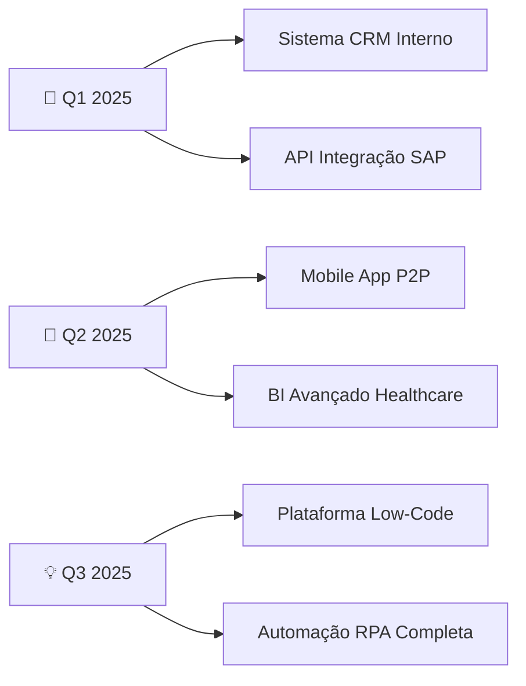

# 👋 Olá, eu sou Arthur Costa Bleck Mascarenhas!

<div align="center">
  
</div>

## 🚀 Sobre Mim

Sou um profissional motivado e sempre em busca de aprendizado, com sólida experiência na área administrativa e fiscal. Apaixonado por tecnologia e automação, estou me especializando em análise de dados e desenvolvimento de soluções inovadoras para otimização de processos empresariais.

---

## 🛠️ Stack Tecnológica

<div align="center">

### 💼 Sistemas Empresariais


### 🐍 Desenvolvimento Python


### 🤖 Automação & IA


### 📊 Business Intelligence & Análise


### 🗄️ Banco de Dados


### 📊 Produtividade


</div>

---

## 📊 Estatísticas GitHub

<div align="center">
  
  
</div>

<div align="center">
  
</div>

---

## 🎯 Meus Projetos

### 🏆 **Projetos Concluídos**

<div align="center">

| 🚀 **Projeto** | 🛠️ **Tecnologias** | 📋 **Descrição** | 🔗 **Demo** |
|:---:|:---:|:---:|:---:|
| **🤖 Sistema de Automação Fiscal** | `Python` `CustomTkinter` `SAP Integration` | Sistema completo para automação de processos fiscais com interface moderna e integração SAP | [🔗 Ver Projeto](https://github.com/Thucosta0/automacao-fiscal) |
| **📊 Dashboard Analytics P2P** | `Python` `Power BI` `Data Analysis` | Dashboard avançado para análise de dados P2P com visualizações interativas e relatórios automatizados | [🔗 Ver Projeto](https://github.com/Thucosta0/dashboard-p2p) |
| **⚡ Scripts de Produtividade** | `Python` `Power Automate` `Office365` | Coleção de scripts para automação de tarefas administrativas e integração com ferramentas corporativas | [🔗 Ver Projeto](https://github.com/Thucosta0/scripts-produtividade) |

</div>

### 🔬 **Em Desenvolvimento Ativo**

```python
projetos_desenvolvimento = {
    "ai_document_processor": {
        "tecnologia": "Python + AI/ML + CustomTkinter",
        "objetivo": "Processamento inteligente de documentos fiscais",
        "status": "🤖 70% - Implementando IA",
        "preview": "Sistema que automatiza análise e classificação de documentos"
    },
    "real_time_dashboard": {
        "tecnologia": "Python + Streamlit + Power BI API",
        "objetivo": "Dashboard em tempo real para KPIs hospitalares", 
        "status": "📊 85% - Finalizando integração",
        "preview": "Visualização ao vivo de métricas críticas"
    },
    "process_optimizer": {
        "tecnologia": "Python + Machine Learning",
        "objetivo": "Otimização preditiva de processos P2P",
        "status": "⚡ 40% - Coletando dados",
        "preview": "IA para prever gargalos e sugerir melhorias"
    }
}
```

### 📈 **Pipeline de Projetos 2025**

<div align="center">



</div>

---

## 💼 Trajetória Profissional

### 🏥 **Hospital Israelita Albert Einstein**

#### 🔧 **Técnico Administrativo II** | *Nov 2024 - Presente*
**ADM Fiscal - CSE - P2P**
- 📋 Gestão estratégica de processos administrativos e fiscais
- 🤖 Implementação de automações com Power Automate
- 📊 Análise e otimização de fluxos de trabalho
- 🎯 Melhoria contínua de processos

#### 📈 **Técnico Administrativo I** | *Mai 2024 - Nov 2024*
**ADM Fiscal - P2P**
- 📄 Geração e ajustes de pedidos e contratos no SAP
- 🧾 Análise, correção e lançamento de NFs/NF-e
- 🔗 Especialização em plataformas SAP, DocuSign e CLM
- 📊 Controle de qualidade de documentos fiscais

#### 🌱 **Aprendiz** | *Fev 2023 - Jan 2024*
**Compras Indiretas**
- 🛒 Suporte especializado em processos de compras indiretas
- 📚 Desenvolvimento acelerado de competências administrativas
- 🤝 Colaboração em projetos de melhoria contínua
- 🎯 Foco em eficiência operacional

---

## 🎓 Formação & Desenvolvimento

### 📚 **Formação Acadêmica**
- 💻 **Gestão de Tecnologia da Informação** - UNIFECAF (2025-2027) | *Em andamento*
- 🌐 **Curso de Inglês Avançado** - KeyUp (2024-2026) | *Em andamento*

### 🏆 **Especializações Técnicas**
- 📊 **Analista de Dados - Básico ao Avançado** - Alura (2025)
- 🧠 **Lógica de Programação** - Alura (2025)
- 🤖 **Automação de Processos** - Microsoft Power Platform
- 📈 **Business Intelligence** - Power BI

---

## 🌟 Competências Core

<div align="center">

### 💡 **Técnicas**
🔧 **SAP** • 📄 **DocuSign & CLM** • 🤖 **Power Automate** • 📊 **Power BI** • 🐍 **Python** • 📈 **Excel Avançado**

### 🎯 **Comportamentais**
📚 **Aprendizado Contínuo** • 🧠 **Pensamento Analítico** • 🤝 **Trabalho em Equipe** • 🚀 **Proatividade** • ⏰ **Gestão de Prioridades**

</div>

---

## 📈 Atividade de Contribuições

<div align="center">
  
</div>

<div align="center">
  
  
</div>

---

## 🌐 Conecte-se Comigo

<div align="center">

[](https://www.linkedin.com/in/arthur-costa-bleck-mascarenhas/)
[](https://github.com/Thucosta0)
[](mailto:thucosta28@gmail.com)

</div>

---

<div align="center">
  
</div>

<div align="center">
  <h3>💭 "A tecnologia é melhor quando aproxima as pessoas e otimiza processos"</h3>
  <p><em>⭐ Se você gostou do meu perfil, não esqueça de dar uma estrela nos repositórios!</em></p>
</div> 